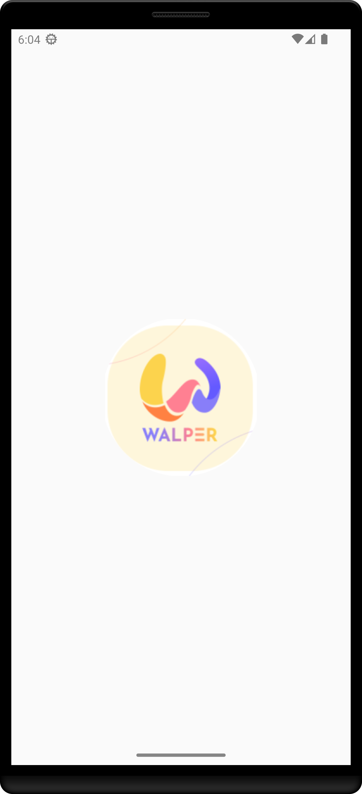
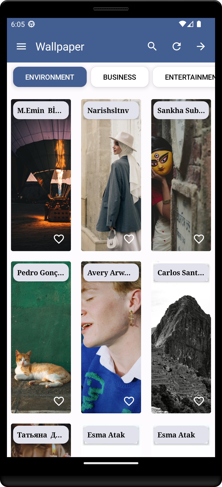
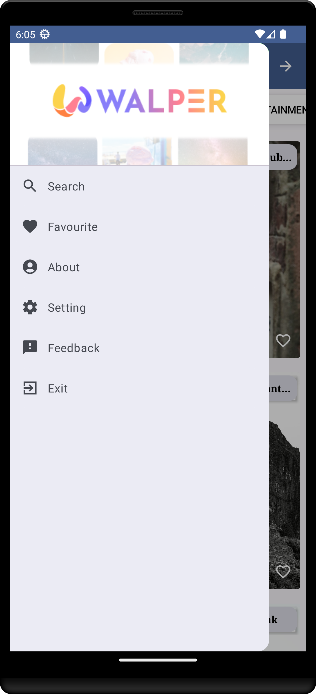
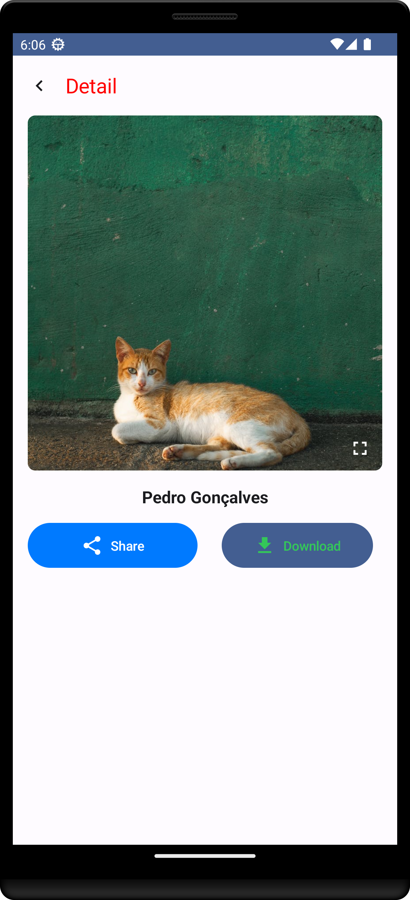
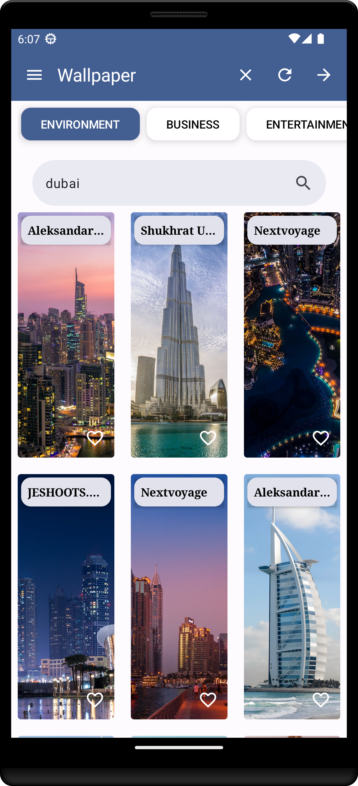

# Wallpaper Compose

Welcome to Wallpaper Compose, an Android app that allows you to discover and explore a stunning collection of wallpapers. This app is built using modern Android development technologies and follows the MVVM architecture pattern.




## Features

- Browse a vast collection of high-quality wallpapers.
- Search for wallpapers by keywords.
- View wallpaper details in full-screen mode.
- Like your favorite wallpapers.
- Enjoy a smooth and responsive user interface built with Jetpack Compose.




## Tech Stack

This project is built with the following technologies:

- [Jetpack Compose](https://developer.android.com/jetpack/compose) - Modern Android UI toolkit for building native UIs.
- [Dagger Hilt](https://dagger.dev/hilt/) - Dependency injection framework.
- [Retrofit](https://square.github.io/retrofit/) - HTTP client for making network requests.
- [HttpClient](https://developer.android.com/jetpack/compose) - Android's built-in HTTP client.
- [Pexels API](https://www.pexels.com/api/documentation/) - Provides access to a vast collection of high-quality photos and wallpapers.
- MVVM (Model-View-ViewModel) - Architecture pattern for separation of concerns and maintainability.




## Getting Started

To run this app locally, you will need Android Studio and an Android emulator or a physical Android device.

1. Clone this repository:

   ```bash
   git clone https://github.com/KhubaibKhan4/Wallpaper-Compose.git

## License
This project is licensed under the MIT License. See the LICENSE file for details.
